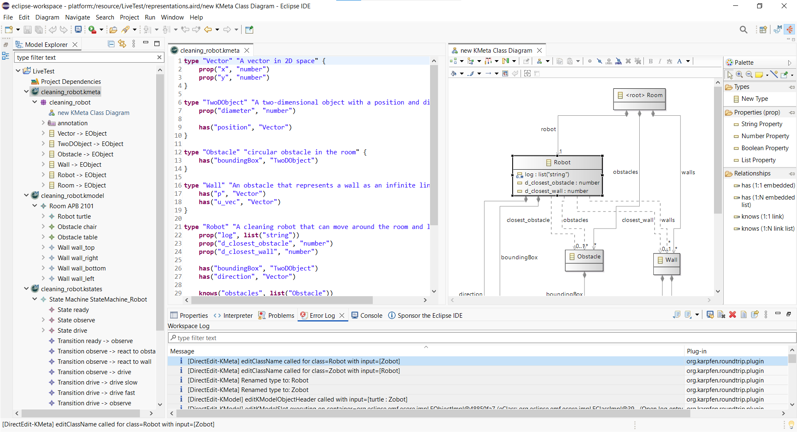

# Karpfen Visual Roundtrip Plugin

A visual roundtrip editing plugin for Karpfen DSLs (.kmeta, .kmodel, .kstates) using Eclipse Sirius and EMF in Eclipse IDE.

<p align="center">
  
</p>

## Prerequisites

* **Java 21**

* **Eclipse Modeling Tools (2026-06 R)**:
https://www.eclipse.org/downloads/packages/release/2026-06/r/eclipse-modeling-tools

### Eclipse IDE Setup and Dependencies (VERY IMPORTANT)

Install the required dependencies inside Eclipse Modeling Tools (2026-06 R):

1. Open Eclipse IDE, then go **Help** -> **Install New Software**
2. Process each of the following update sites in **Work with** field and **Add** them:
* **Acceleo 4**:
https://download.eclipse.org/acceleo/updates/releases/4.2/R202603201315/
* **Sirius**:
https://download.eclipse.org/sirius/updates/releases/7.5.0/2025-09/
3. Select all items (checkbox) for **Acceleo** and continue installation
4. Restart Eclipse, do the same for **Sirius**

## Option 1: Prebuilt Installation

1. Download it from **Github Releases**, place prebuilt jar plugin ```org.karpfen.roundtrip.plugin_1.0.0.jar``` into your Eclipse ``dropins`` folder:
```
<path>\eclipse-modeling-2026-06-R-win32-x86_64\eclipse\dropins
```

2. Delete the old OSGI cache folder:
```
<path>\eclipse-modeling-2026-06-R-win32-x86_64\eclipse\configuration\org.eclipse.osgi
```

3. Start Eclipse.

---

## Option 2: Development Installation (Built from Source)

1. Clone this repository:
```bash
git clone https://github.com/syglo/karpfen-roundtrip-plugin.git 
```

2. Set your downloaded Eclipse IDE directory path and Java Runtime for VSCode development in `gradle.properties`:
```properties
eclipseHome=<path>/eclipse-modeling-2026-06-R-win32-x86_64/eclipse
org.gradle.java.home=<path>/eclipse-modeling-2026-06-R-win32-x86_64/eclipse/plugins/org.eclipse.justj.openjdk.hotspot.jre.full.win32.x86_64_21.0.12.v20260826-1216/jre
```
It will use Java version bundled with Eclipse for compilation of the plugin. The location of eclipse jre, from downloaded and unpacked Eclipse IDE locally, is inside: eclipse/plugins/org.eclipse.justj.xxxxxx (folder)

3. Build and automatically deploy the plugin:

```bash
# Run first this command, it will git clone karpfen-dsl-tools repo and build jar file
./gradlew setupKarpfenJar

# Multiple steps defined in build.gradle.kts
# Generates .odesign, builds FAT Jar, clears OSGI cache, and copies to eclipse/dropins/
./gradlew eclipsereload
```

4. Start Eclipse.

---

## Quick Start and Usage

1. **Start Eclipse** with the installed plugin.
2. **Create a Modeling Project**: Go to **File** -> **New** -> **Other** -> In selection Wizard: **Sirius / Modeling Project**.
3. **Add DSL Models**: Copy drag your `.kmeta`, `.kmodel`, or `.kstates` files into the project, or use the provided reference files in `example/statemachine_full_example/`.
  The project workspace folder is on the left side (Model Explorer Window)
4. **Enable Viewpoints**: Right-click the project; **Viewpoints Selection**, and enable the **Karpfen Visualizations**.
5. **Create Representation**: Expand nested directory in any Karpfen file (.kmeta, .kmodel, .kstates) in the Project Explorer; Right-click on top root, then press **New Representation** to open the graphical Sirius editor.
6. **Roundtrip Editing**:
   * Open .k* text file, changes made in the text editor update the diagram view.
   * Open K* Diagram view, changes made on the diagram canvas are validated and serialized directly back into the `.k*` text files on disk.


* Every element on the canvas is selectable and visible in Properties window at the bottom.

* For example clicking on labels selects it and reflected in Properties window. To direct edit this label, while its selected (highlighted in blue), click once more. Don't double click.

* Model explorer window on the left shows model EMF ecore tree.

* We can open text editor for the model if double click on the root file with extension in the name on the end like .kmeta

* Available tools are on the right side Palette Window.

---

## Verification, Benchmarks, and Documentation

* **Execute JUnit and Transformation Tests**:
  ```bash
  ./gradlew test
  ```

* **Execute Benchmarks**:
  ```bash
  ./gradlew benchmark
  ```

* **Generate Documentation**:
  ```bash
  ./gradlew javadoc
  ```

---

## License

This project is licensed under the Apache License, Version 2.0 - see the [LICENSE](LICENSE) file for details.

### Third-Party Licenses
This project uses and bundles third-party software:
* **karpfen-dsl-tools** - Copyright 2026 Karl Kegel, licensed under the Apache License, Version 2.0.
* **ANTLR 4 Runtime** - Copyright The ANTLR Project, licensed under the BSD-3-Clause License.
* **Kotlin Standard Library** - Copyright JetBrains s.r.o., licensed under the Apache License, Version 2.0.
* **Eclipse Sirius / EMF / ELK** - Licensed under the Eclipse Public License 2.0 (EPL-2.0).

---

*Parts of this project have been developed with the help of generative AI*.